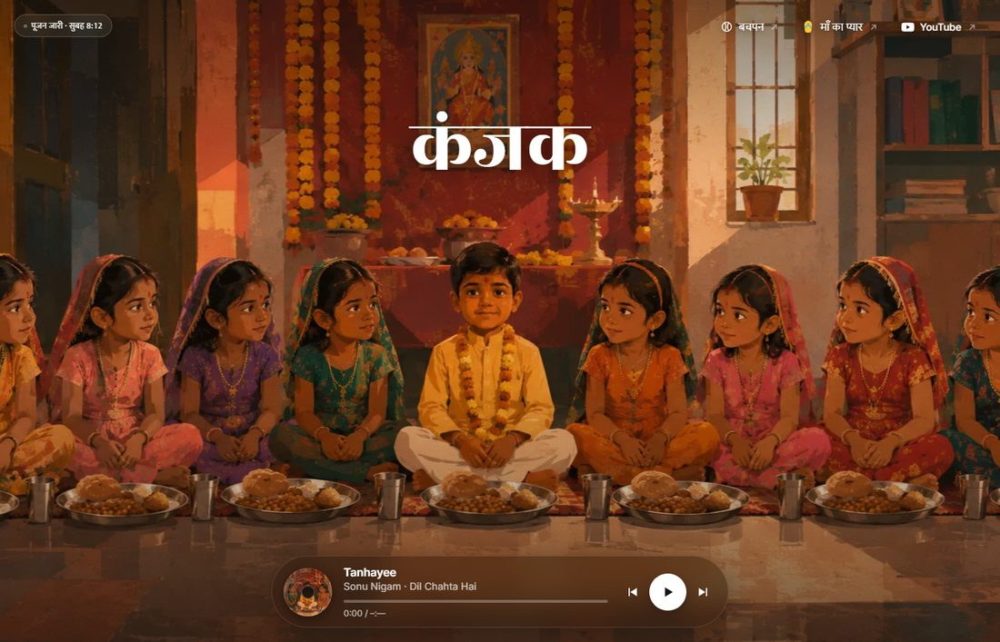
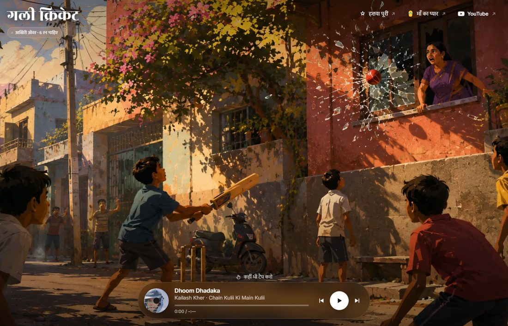
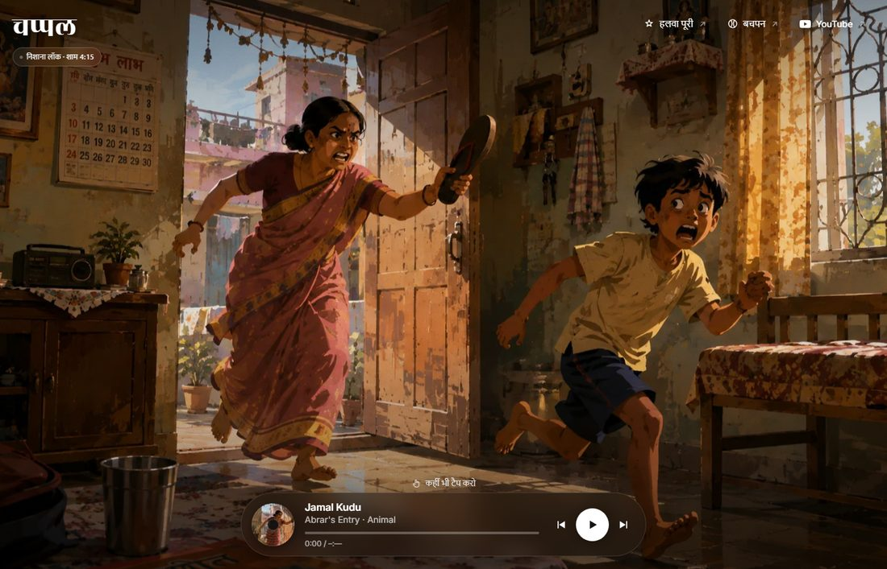

# viral-ai-webpages

Three single-scene web pages. Each one is a painted Indian moment, a song that
scores it, and nothing else — no scroll, no copy explaining the joke.

Built in the spirit of [saloon.wtf](https://saloon.wtf) and
[roadways.wtf](https://roadways.wtf): the artwork carries the whole frame, the
UI stays out of its way.

---

## कंजक

Ashtami morning. Eight kanya, one langoor, and the smallest boy in the room
working out that he is the joke.



**Tanhayee** (Sonu Nigam · Dil Chahta Hai) → **Chalo Bulawa Aaya Hai**
(Narendra Chanchal · Avtaar)

No tap effects here on purpose — it is a puja, and popping snark out of it on
every tap cheapens the one joke the picture already tells.

---

## गली क्रिकेट

Golden hour, last over, six needed. The shot that lands a fraction before the
window goes.



**Dhoom Dhadaka** (Kailash Kher · Chain Kulii Ki Main Kulii) → **Purani Jeans**
(Ali Haider) → **Chale Chalo** (A. R. Rahman · Lagaan)

Tap anywhere: glass blooms where you hit, the camera flinches, a caption lands.

---

## चप्पल

The world's first guided missile. Range unlimited, accuracy 100%.



**Jamal Kudu** (Abrar's Entry · Animal) → **Bhaag D.K. Bose** (Ram Sampath ·
Delhi Belly)

Tap anywhere and it launches *across* the frame, never away from you. That is
the joke.

---

## How it works

Plain HTML, CSS and JavaScript. No build step, no framework, no dependencies.

| | |
|---|---|
| Audio | A hidden YouTube IFrame player. Each track lists fallback video IDs, so a pulled or embed-blocked upload silently rolls to another copy of the same song. |
| Autoplay | There is no "tap to start" gate. The first tap anywhere is the gesture that lets the page unmute. |
| Motion | One still per page, overscaled, drifting and swaying on deliberately non-multiple durations (41s / 29s) so the loop never reads as a metronome. |
| Navigation | The player's ⏮ ⏭ walk between the three pages, not between tracks — they are one ring. Extra songs still get heard: a track ending advances to the next one on that page. |
| Weight | 226–298 KB on load. Scenes are WebP at q82; social cards are JPEG, because 1 MB PNGs get silently dropped by WhatsApp. |

Each page is self-contained in its own folder — `index.html`, `styles.css`,
`player.js` (shared, identical across all three) and `app.js` (the per-scene
tracks, captions and effects).

## Running locally

```sh
python -m http.server 8000
```

Then open `http://localhost:8000/kanjak-wtf/`.

## Deploying

Each folder is a static site. On Vercel, create one project per scene and set
**Root Directory** to that folder — no build command, no output directory.

> **Before going live:** `og:url`, `og:image` and `canonical` in each
> `index.html` are absolute and currently point at `kanjak.wtf`,
> `gullycricket.wtf` and `chappal.wtf`. Change them to whatever domain you
> land on. They must stay absolute — a relative `og:image` means no preview
> card on WhatsApp, Twitter or iMessage. Each file has a `DEPLOY:` comment
> marking the spot.

## Credits

Scene artwork generated for this project. Album art belongs to the respective
labels — Saregama, T-Series, Sony Music and Archies Music. The flying chappal
is adapted from [SVG Repo](https://www.svgrepo.com/svg/232532/slippers-slipper)
(CC0). Songs play from YouTube; nothing is rehosted.
